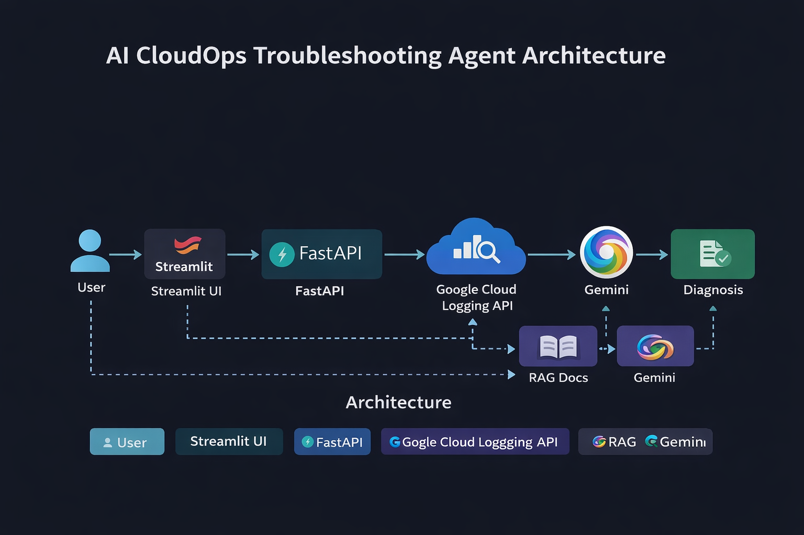

# AI CloudOps Troubleshooting Agent

An AI-powered CloudOps assistant that automatically diagnoses Google Cloud service failures using real logs and Gemini.

## Features

- Retrieves real logs from Google Cloud Logging
- Uses Gemini (Google Generative AI) for root cause analysis
- Retrieval-Augmented Generation using GCP documentation
- FastAPI backend deployed on Cloud Run
- Streamlit UI for interactive debugging

## Architecture

User → Streamlit UI → FastAPI API →  
Cloud Logging API → RAG Docs → Gemini → Diagnosis

## Stack

- Python
- FastAPI
- Streamlit
- LangChain
- Gemini (Google Generative AI)
- Google Cloud Logging
- FAISS Vector Database
- Docker
- Cloud Run

## Example Output

Finding root cause using the logs registered from the errors inside the docker container deployed on GCP:

Root Cause: Container not listening on port 8080  
Evidence: Logs show container startup failure  
Fix: Bind service to 0.0.0.0:8080

## Deployment

Containerized with Docker and deployed to Google Cloud Run.

## Demo

FastAPI API deployed on Cloud Run.
Streamlit UI runs locally.
